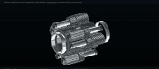
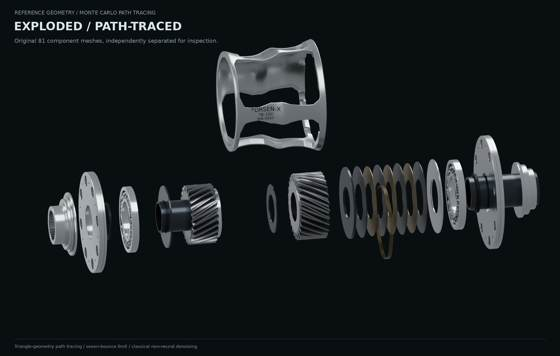
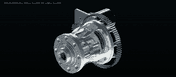

# CYBR GEO / Mechanism Lab

Procedural geometry, named CAD/mesh assemblies, internal and exploded inspection, geometry-rendered video, individual-part catalogues, and whiteprint engineering drawings.

**Both source toolkits are published here:** the newer `lab` CLI (`src/mechanism_lab`) and the original `cybrgeo` CLI (`src/cybrgeo`). Model recipes supply geometry, materials, named parts, camera views and motion transforms. The shared infrastructure handles export, rendering, animation, catalogues and drawings; a new part does not need a new renderer.

## Differential previews







These compact previews were retained from the earlier delivery. Source for the original concept, principal-reference reconstruction and internal/exploded motion study is under [concept v1](archive/concept_v1), [reference v2](archive/reference_v2), and [inspection v3](examples/differential).

The 81-part reference reconstruction and 44-part alternative kinematic core are separate designs. The original interior did not form a connected pinion train; the alternative demonstrates prescribed differential constraints. Neither is a validated torque-bias/contact-force simulation or manufacturing release.

## Two separate motor studies

**REV NEO Vortex + SPARK Flex:** manufacturer mechanical CAD import and an adapted 20T/80T, 4:1 carrier drive. The CAD does not disclose detailed copper windings, magnets or circuitry. See [REV study source](tools/build_motor_study.py), [reference downloader](tools/fetch_references.py), [pinned reference hashes](references/neo_vortex/pinned_sources.json), and [study notes](examples/neo_vortex/README.md).

**M8325s + 2.25:1 belt drive:** procedural motor recipe, illustrative copper coils and magnet poles, and a 32T/72T carrier-drive integration study. Hidden electromagnetic topology is assumed, not recovered factory CAD. See [motor recipe](src/mechanism_lab/models/motor.py), [drive recipe](src/mechanism_lab/models/drivetrain.py), [source/assumption ledger](docs/MOTOR_SOURCES.md), and [compatibility limits](docs/COMPATIBILITY.md).

Both models remain available; one does not silently replace the other. Motor/differential compatibility is a custom-adapter concept, not a validated physical pairing.

## Install

Python 3.11–3.13; Linux/WSL is the documented environment. Install FFmpeg, a C++17/OpenMP compiler, CMake, Cairo, EGL/OpenGL and Mesa system libraries first. Keep the source checkout and its `assets/` and `native/` directories together.

```bash
git clone https://github.com/cybrdelic/cybr-geo.git
cd cybr-geo
python -m venv .venv
source .venv/bin/activate
python -m pip install -r requirements-tested.txt
python -m pip install --no-deps -e .
lab doctor
```

## Reuse for a new part

```bash
# Independent parametric recipe: same pipeline as the motors.
lab build examples/custom_flange.py --step --stl
lab render examples/custom_flange.py
lab video examples/custom_flange.py --view exploded --action explode --seconds 8
lab blueprint examples/custom_flange.py

# Procedural motor, including illustrative stator coils.
lab build m8325s --step
lab render m8325s --view stator --renderer pathtrace --spp 64 --threads 4
lab video m8325s --view internal --action motion --seconds 8
lab catalogue m8325s

# Restore original NPZ inputs from a prior package, OR regenerate them explicitly.
python tools/rebuild_differential_inputs.py
lab build differential_reference
lab build differential_core
lab build drivetrain --step
lab video drivetrain --view drive_face --action motion --seconds 8

# The original build() -> cybrgeo.Assembly API is preserved.
cybrgeo build examples/template_part.py --out build/template
cybrgeo render build/template --out build/template/hero.png
cybrgeo whiteprint build/template --out build/template/drawing --title 'TEMPLATE PART'
```

For the manufacturer-CAD motor:

```bash
python tools/fetch_references.py
python tools/import_motor.py
python -c 'from tools.build_motor_study import prepare_motor; prepare_motor()'
python tools/render_motor_study.py --motor-only
```

`tools/build_release_media.py` reproduces the later motor and belt-drive media after the differential inputs are available. It includes the actual camera/animation recipes, not image-generation prompts.

## Whiteprints

Analytic CAD uses OpenCascade hidden-line removal. The drawing tools emit SVG, vector PDF, DXF, PNG and drawing metadata with nominal dimensions, centerlines, explicit units and title blocks. The `lab` mesh-only fallback is explicitly labeled as a projection without hidden-line suppression; `cybrgeo` requires analytic CAD. These are concept/reference drawings, not tolerance-qualified manufacturing drawings.

[Drawing tools](docs/WHITEPRINTS.md) · [Architecture](docs/ARCHITECTURE.md) · [Reproduction and extension](docs/REPRODUCE.md) · [Earlier API documentation](docs/cybrgeo_previous/ARCHITECTURE.md)

## Publication and verification

The source import is checksum-verified and unpacked into ordinary tracked files. The README previews are ordinary image/GIF files, not Git LFS pointers. [Server-side source receipts](docs/publication_receipts) record the transferred archive checksums.

**Source publication is distinct from binary-archive publication.** The full historical MP4s, per-part renders, STEP/GLB outputs and original NPZ input archives are not all in this checkout. The retained source can regenerate them; the reconstruction script does not falsely label regenerated arrays as byte-identical originals. Original delivery descriptions in the documentation describe their historical local packages, not a guarantee that every binary is in the GitHub tree. [Publication inventory](docs/PUBLICATION_INVENTORY.md) lists this distinction.

Run the source-only smoke tests without requiring the original output archives:

```bash
python -m pytest -q tests/test_core.py tests/test_drawings_media.py tests_legacy -k "not individual_motor_parts"
# Full suite, after building inputs and the optional release artifacts:
python -m pytest -q
```

The tests cover analytic geometry, cache integrity, units, import/export, transforms, decoded GLB animations, belt-path continuity, vectors in drawings, actual changing video frames, and README asset paths. A test definition or historical report is not itself proof of a fresh successful run.

The repository's GPL-2.0 license is retained for project code. Manufacturer CAD, photographs, drawings and trademarks retain their own rights. No mechanical, electromagnetic, thermal or load qualification is claimed.
