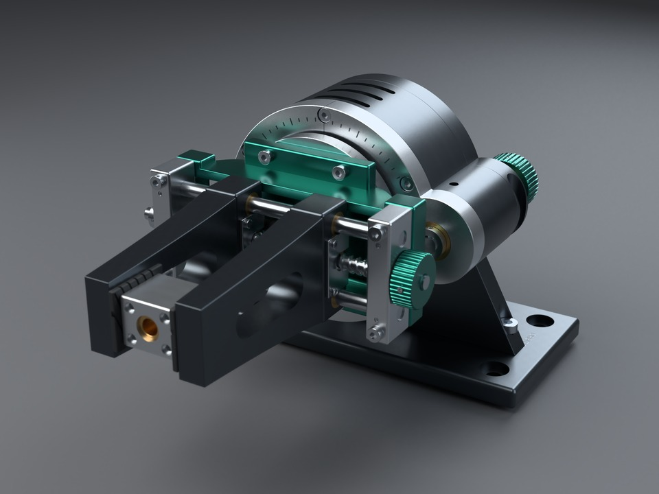
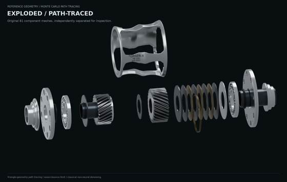

# CYBR GEO

**Procedural CAD, mechanical assemblies and geometry-driven rendering.**

One parametric recipe produces named parts, analytic solids, inspection views, motion, drawings and renderable geometry. Built in Python with CadQuery/OpenCascade, with the CYBR LIGHT C++ spectral renderer bundled in the toolkit.



*ORBIT: 148 components, geared wrist, opposed-screw gripper, hollow palm and removable housing.* [Recipe](examples/orbit_inspection_wrist.py) · [Service sequence](docs/ORBIT_SERVICE.md) · [Geometry coverage](docs/ORBIT_SHOWCASE.md)

## Selected work

| Project | Engineering focus | Source |
| --- | --- | --- |
| **ORBIT** | Analytic assemblies, gearing, motion and a 331-operation service sequence | [Wrist recipe](examples/orbit_inspection_wrist.py) |
| **ROAM** | Seven workshop mechanisms and an articulated mobile workstation | [Workshop](examples/roam/README.md) |
| **Nitinol actuator** | Twelve SMA fibers, guided carriage and explicit electrical routing | [Actuator recipe](src/mechanism_lab/models/nitinol_actuator.py) |
| **Motor / belt drive** | Procedural motor construction, pulley/belt geometry and mechanical integration | [Motor](src/mechanism_lab/models/motor.py) · [Drivetrain](src/mechanism_lab/models/drivetrain.py) |
| **Differential** | Internal inspection, exploded views and prescribed differential kinematics | [Study](examples/differential/README.md) |
| **CYBR YARD** | A 1,404-part parametric skatepark, timber framing and outdoor rendering | [Recipe](examples/diy_skatepark/recipe.py) |



## Run it

Linux or WSL2, Python **3.11–3.13**. On Ubuntu, install the native tools once:

```bash
sudo apt-get update
sudo apt-get install -y g++ cmake ffmpeg libcairo2 libegl1 libgl1 libopengl0 libglib2.0-0
git clone https://github.com/cybrdelic/cybr-geo.git
cd cybr-geo
python3 -m venv .venv
source .venv/bin/activate
python -m pip install -r requirements-tested.txt
python -m pip install --no-deps --no-build-isolation -e .
lab preview --step
```

`lab preview` builds an independent flange recipe, checks its geometry, exports a GLB and component list, renders a native 640 × 480 image, reads the exported GLB back and checks the image dimensions. `--step` also exports analytic CAD. Results are in **`outputs/example_flange/preview/`**; `preview.json` is written only after successful completion.

This first run uses CYBR LIGHT and included geometry. The engine compiles once on demand. It writes indexed meshlets, linear PFM/EXR films, diagnostic passes and filtered/unfiltered PNGs. No renderer or lighting assets are downloaded.

```bash
lab preview nitinol_fiber_actuator --spp 64
lab preview examples/custom_flange.py --step
lab build nitinol_fiber_actuator --step --stl
lab animate nitinol_fiber_actuator --seconds 6
lab blueprint nitinol_fiber_actuator
```

`lab render`, `lab video` and `lab film` also default to **CYBR LIGHT**. Smooth normals, real assembly poses, thin-lens optics, anisotropic metals and spectral glass reach the native engine. Three fixed softboxes give mechanical parts readable highlights. Select `--renderer pbr` for raster inspection, or `--renderer photoreal` for the older native renderer.

```bash
lab render examples/orbit_inspection_wrist.py --size 1600x1200 --spp 256
lab film examples/orbit_inspection_wrist.py --action orbit --seconds 4 --spp 128
```

[Rendering and meshlet format](docs/SHARED_PHOTOGRAPHY.md) · [More commands and reference preparation](docs/GETTING_STARTED.md).

## How it works

| System | Implementation |
| --- | --- |
| Geometry contract | [`Assembly`, `Part`, `Material`, `View`](src/mechanism_lab/core.py); named components and rigid poses |
| Parametric construction | [CAD helpers](src/mechanism_lab/geometry.py), [advanced geometry](src/mechanism_lab/advanced_geometry.py), [recipes](src/mechanism_lab/models) |
| Reusable pipeline | [Recipe registry and cache](src/mechanism_lab/registry.py), [one-command preview](src/mechanism_lab/preview.py) |
| Spectral rendering | [CYBR LIGHT engine](src/cybr_light/native), [assembly adapter](src/mechanism_lab/light.py), [indexed meshlets](src/cybr_light/runtime.py) |
| CAD and interchange | [STEP, STL, GLB and animated glTF](src/mechanism_lab/exporters.py); explicit mm/Z-up → m/Y-up conversion |
| Drawings | [OpenCascade hidden-line projection and vector drawing export](src/mechanism_lab/whiteprint.py) |
| Assembly motion | [Service process and clearance checks](src/mechanism_lab/assembly_process.py) |

Recipes define the object; shared code handles its outputs. Geometry validation runs during recipe creation and its report is retained with the cache. Source, declared recipe dependencies and retained input changes invalidate that cache. The original `cybrgeo` CLI/API remains available alongside `lab`.

## Development

```bash
make test-core       # independent geometry / rendering contracts
make preview         # real CAD → GLB / STEP → native image
make test            # complete suite; see prerequisite notes below
```

[Quickstart CI](.github/workflows/quickstart.yml) exercises the documented install and preview on Python 3.11–3.13. The [complete regression workflow](.github/workflows/recovery-regressions.yml) regenerates the differential inputs before running the full suite. Historical release-output tests can skip when their archives are absent; [test scope and setup](docs/GETTING_STARTED.md#tests) explains the distinction.

## Scope and license

These are parametric geometry, rendering and kinematic studies. Physical load, fatigue, production fits and manufacturing qualification are separate work. Vendor CAD is identified where used; conceptual internals and original geometry retain their provenance. [Sources](docs/MOTOR_SOURCES.md) · [Compatibility](docs/COMPATIBILITY.md) · [Publication inventory](docs/PUBLICATION_INVENTORY.md) · [Architecture](docs/ARCHITECTURE.md).

GPL-2.0-only for project code. Third-party assets retain their own rights. Created by [Alejandro Figueroa / cybrdelic](https://github.com/cybrdelic).
