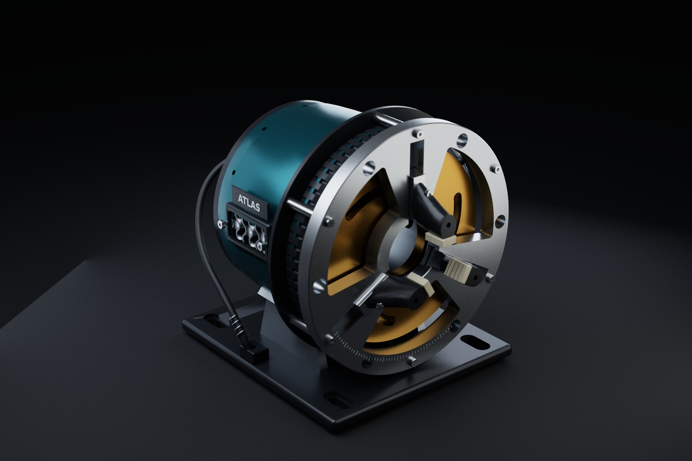
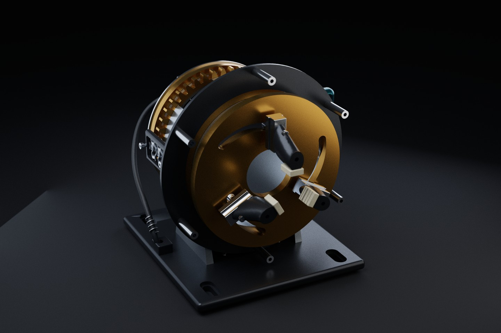
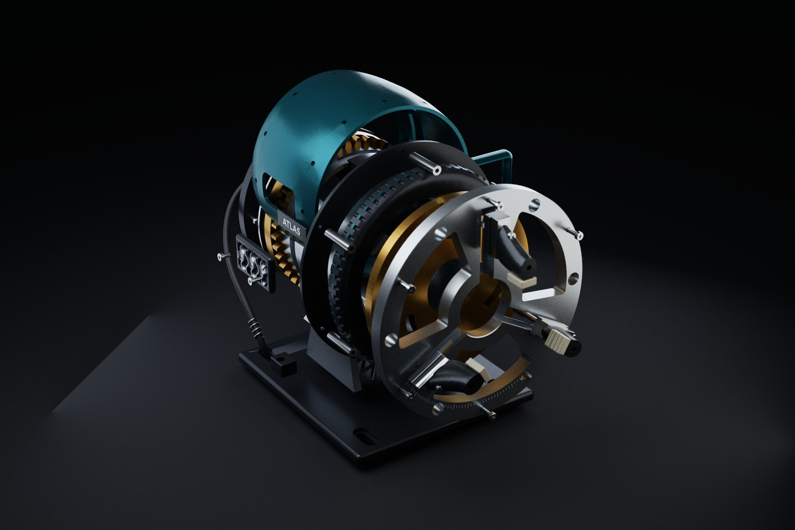
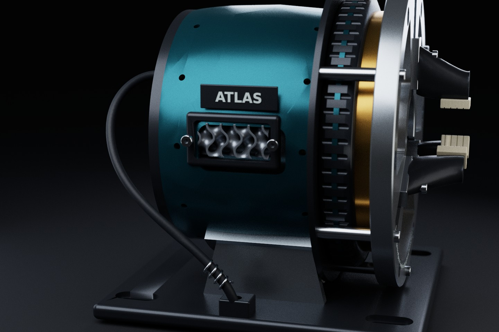
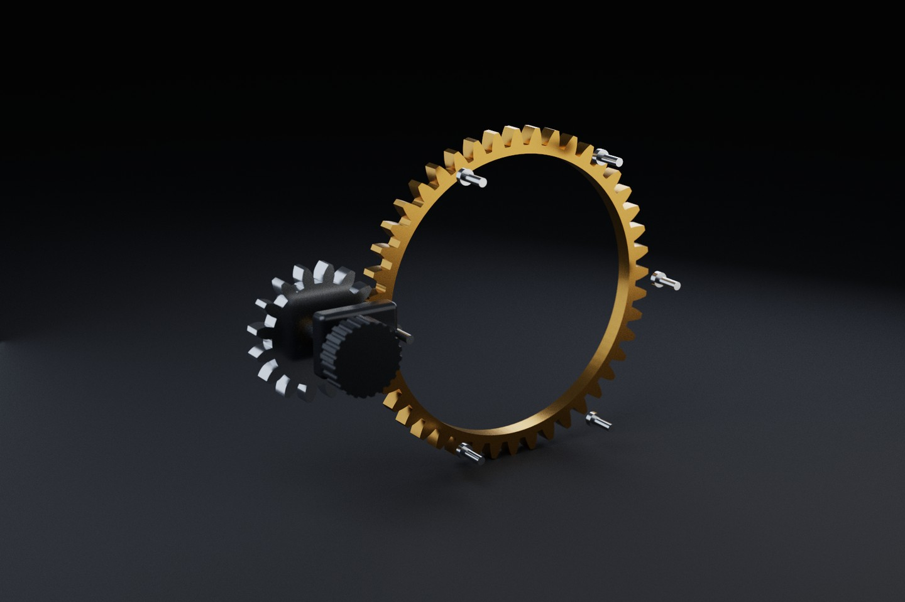
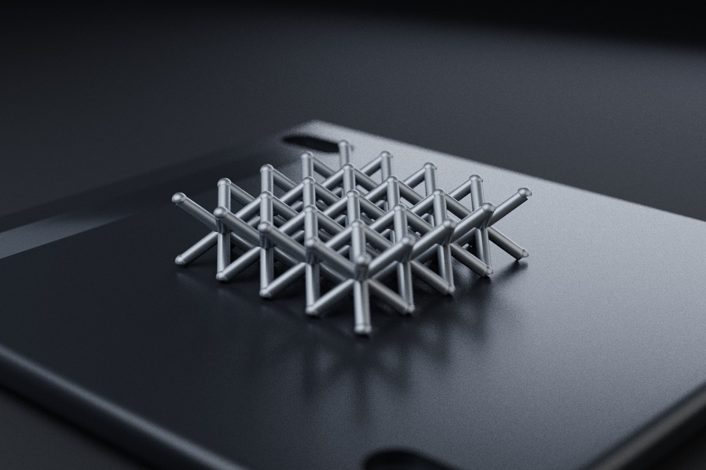

# ATLAS / self-centering inspection fixture

ATLAS is an original desktop fixture for holding round parts during visual
inspection and small-part assembly. Three radial jaws open together from a
nominal 28 mm to 48 mm tangent-plane aperture. A bronze spiral cam sets their
positions. The fluted handwheel turns that cam directly; the smaller knob drives
it through a 44:16 involute gear pair for finer adjustment.

The model combines the original `cybrgeo.features` gear tools and the newer
`mechanism_lab` hybrid geometry toolkit. Its photographs use the repository's
native photographic path tracer. No image generation, imported product model,
Blender scene, or composited mechanical detail is involved.







## Geometry coverage

| Geometry family | ATLAS construction | Representation |
| --- | --- | --- |
| Extruded profiles, slots, bores | Counterbored bench slots, guide face, bearing brackets | OpenCascade BREP |
| Fillets and chamfers | Base edges, pad edges, socket screws, inspection-window corners | OpenCascade BREP |
| Freeform multi-section lofts | Five-section housing and asymmetric jaw carriers | Smooth BREP lofts |
| Hollow shells and CSG | Lofted housing wall, inspection windows, peripheral gear guard | Subtractive BREP solids |
| Revolved profiles | Stepped handwheel rim | Revolved BREP |
| Curve offsets and spline paths | Three normal-offset Archimedean cam slots | Interpolated BREP spline flanks |
| 3D spline sweeps | Routed service conduit | Continuous swept BREP |
| True helical sweeps | Cable strain-relief spring | Continuous swept BREP |
| Involute gear profiles | 44-tooth input ring and 16-tooth pinion, module 2.5 mm | BREP extrusions of sampled involute profiles |
| Drafted extrusion | Service connector | Tapered BREP solid |
| Toroidal geometry | Annular seal and its matching gland | Analytic torus and boolean cut |
| Ruled lofts | Tapered support webs | Two-section ruled BREP |
| Analytic lattice | 4 x 4 x 1 BCC pedestal | Compound of analytic struts and nodes |
| Implicit / field geometry | Removable gyroid cartridge | VTK FlyingEdges extraction of a scalar field |
| Parallel-transport tubes | Fine copper conductors | Purpose-built triangle meshes |
| Geometric typography | ATLAS identification plaque | Extruded vector text |
| Linear and circular patterns | Grip flutes, dial marks, vents, mounting holes, fasteners | Repeated real geometry |
| Assembly kinematics | Cam rotation, gear ratio, radial jaws, inspection explosion | Named rigid transforms |
| CAD and mesh interchange | STEP, GLB, animated GLB, individual STL, BOM | Shared CYBR GEO exporters |
| Engineering projection | Four-view nominal whiteprint | OpenCascade hidden-line removal; SVG/PDF/DXF |

The capability manifest maps every technique tag to its actual named parts.
This demonstrates the project's principal geometry families; it is not a claim
that every possible CAD operation or every historical model is present in one fixture.







## What is geometrically checked

- Every named analytic shape passes OpenCascade validity checks.
- Every part's tessellated surface is watertight with consistent winding after
  welding coincident vertices for the topology check.
- The actual cut cam solid clears sampled follower circumferences at 13 poses
  spanning the complete opening stroke, on all three jaws.
- Actual slider solids have zero volumetric intersection with the stationary
  guide face at five poses. Their centers remain equally spaced about the axis.
- The rotating handwheel and cam clear the stationary support posts.
- The two generated involute profiles have no positive intersection area over
  181 sampled gear-pair poses, using the prescribed 44:16 angular relationship.
- The gear ring has a real recessed sleeve seat and a separate key in matching
  keyways; the gear, sleeve, and key do not overlap volumetrically.
- The corrected continuous helix has the expected swept-circle volume and
  radial envelope. Its profile is positioned at the actual helix start point
  and oriented to the actual curve tangent.

The tests sample geometric constraints. They do not establish arbitrary-pose
global collision freedom, friction, contact forces, gear life, holding force,
thermal behavior, manufacturability, or safe operating loads.

The delivered run records [geometry verification](atlas_verification.json) and
[per-view render settings, times, and image hashes](atlas_render_evidence.json).

## Representation and engineering limits

The motion is a prescribed kinematic model: cam angle determines radial travel,
and the involute input follows the fixed tooth ratio. There is no hidden force
solver or fitted visual motion. No workpiece is inserted during the opening
cycle, so the jaws do not visually pass through a clamped specimen.

The BCC pedestal is a compound of overlapping struts and nodes, not a
boolean-unified production lattice. The gyroid is native field geometry; it
and the three fine conductor meshes are intentionally omitted from analytic
STEP. The complete GLB and STL set retain them. The service cartridge and
connector are original packaging geometry, with no sensor, acoustic, cooling,
or filtration performance claimed. The gear generator's root transitions are
not cutter-envelope certified, and its involute flanks are sampled polylines.

Material colors, roughness, metallic response, and surface finishes are authored
design choices. The native renderer supplies physical lens rays, depth of
field, area lighting, global illumination, GGX reflection, and MIS sampling.
The final stills use at least 384 samples per pixel and are delivered without
the low-sample spatial denoising pass. Samples per pixel are a render setting,
not proof of complete Monte Carlo convergence.

## Reproduce

The delivered run used Python 3.12.14, CadQuery 2.7.0, OpenCascade bindings
7.8.1.1.post1, and VTK 9.3.1. The render package records the full observed
environment; this is distinct from the repository's newer general dependency pins.

Install the repository dependencies and FFmpeg/CMake first, then run:

```bash
export PYTHONPATH=src

# Rebuild the native assembly and all portable geometry exports.
python tools/build_atlas.py build

# Actual BREP and sampled gear/cam checks.
python -m pytest -q tests/test_atlas_fixture.py tests/test_photoreal_contract.py

# Native photographic rendering; no third-party renderer.
python tools/build_atlas.py stills --views hero --size 1800x1200 --spp 512 --threads 8
python tools/build_atlas.py stills --views cutaway exploded --size 1800x1200 --spp 384 --threads 8
python tools/build_atlas.py stills --views materials_macro gear_macro --size 1600x1066 --spp 384 --threads 8
python tools/build_atlas.py stills --views lattice_macro --size 1200x800 --spp 384 --threads 8

# Geometry-derived four-view vector drawing.
python tools/build_atlas.py drawing

# Optional full 24-second photographic film. Every frame is newly path traced.
# The still delivery does not claim this optional film has already been rendered.
python tools/build_atlas.py film --size 1920x1080 --spp 384 --fps 24 --threads 8

# Built-in registry access and individual-part tooling remain available.
lab build atlas_fixture --step --stl
lab catalogue atlas_fixture
```

The animated GLB files contain the complete eight-second opening/closing cycle
and an eight-second exploded inspection cycle. They are actual transform
animations on the delivered mesh geometry, rather than a camera move applied
to a still photograph.

The delivered whiteprint shows the selected exterior interface parts in nominal
dimensions. It is a concept/reference drawing, not a released manufacturing drawing.
