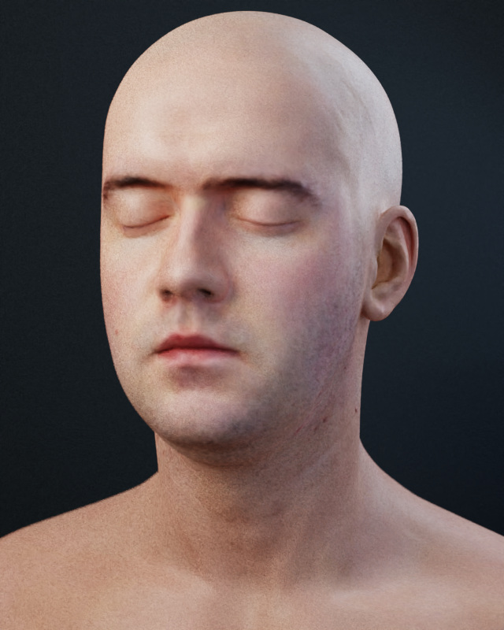
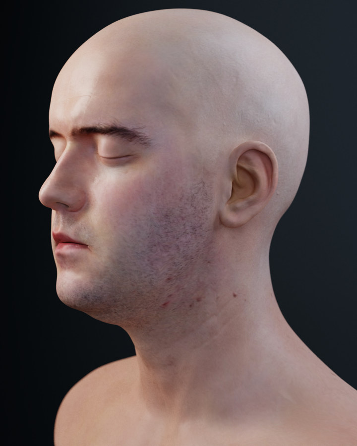
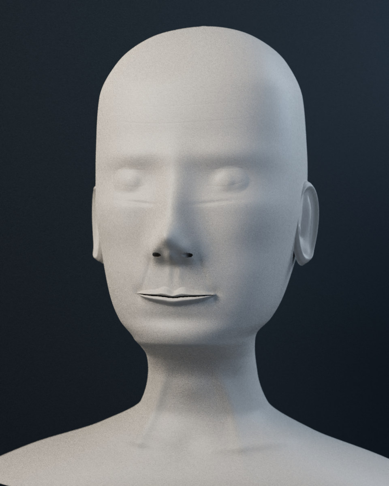

# CYBR GEO human face / v9 portrait

The portrait is a real textured mesh assembled through CYBR GEO's
`Assembly`, `Part`, `Material`, and `View` interface. The portrait renderer uses
the **actual approved ORBIT v9 Mitsuba code**, recovered from CYBR GEO commit
`40797a6fa756ce209b5e21dd83f2df1e41dbd5fb`.







## Anatomy and geometry

The anatomical base is **Infinite, 3D Head Scan by Lee Perry-Smith**, distributed
through the Three.js examples under Creative Commons Attribution 3.0 Unported.
The original scan's closed eyelids are retained. Source geometry and textures
are attributed inputs. The face was not sculpted from scratch by CYBR GEO.

The recipe welds the source geometry before two Loop subdivision levels, keeps
UV seams separate from the geometric topology, and adds high-pass detail from
the supplied 4096px displacement map. Relief is limited to ±25 micrometres.
Seam samples are averaged before displacement so they cannot split the mesh.
The original 17,684 triangles become **282,944 triangles**. Coordinates are
converted to CYBR GEO's millimetres and Z-up convention.

The skin shader uses the attributed color and tangent-normal maps, a roughness
map derived from the source specular map, and an explicitly authored Principled
BSDF. The 1024px color/normal texture resolution remains a visible limit in
close views. The BSDF's flatness term is a surface approximation to skin-like
scattering; this delivery does **not** implement a measured multilayer BSSRDF
or a volumetric skin transport model.

## Rendering

- Mitsuba 3 LLVM CPU path tracing with multiple importance sampling.
- The same Poly Haven `small_workshop` HDR environment used by ORBIT v9,
  attenuated beneath three physical portrait softboxes and a modeled backdrop.
- V9's thin-lens camera construction, Gaussian reconstruction filter (0.42),
  HDR beauty/albedo/shading-normal AOVs, Intel OIDN high-quality guide-based
  denoising, and original ACES approximation followed by sRGB transfer.
- Portrait and profile use f/16. Autofocus traces the central camera ray onto
  the actual visible skin surface; the framing target lies inside the head and
  is not used as a focus target. The render receipt records both distances and
  the 3D focus point. This corrects the focus error found during close-up QA.
- The profile fill panel is moved farther behind that camera and scaled around
  its lighting target to retain angular size. The renderer rejects a central
  ray blocked by an object other than the anatomy, and rejects blank frames.
- Portrait: 1440 × 1800, 512 samples per pixel, 14-bounce limit.
- Profile: 1200 × 1500, 384 samples per pixel, 14-bounce limit.
- Clay proof: 960 × 1200, 128 samples per pixel, 14-bounce limit.
- Final views use v9's original single-pass sample accumulation, seed
  `20260914`. The command also supports independent smaller batches using
  `--batch-spp`; the actual batch size is recorded in each receipt. Smaller
  batches use seed `20260914 + completed_spp * 131` and accumulate linear
  radiance before denoising and tone mapping.

The source OBJ, model, raw and denoised images, and JSON render receipts are
written together. Every image is rendered from geometry. No image generation,
painted-over render, or image synthesis is used. The clay image removes the skin
maps to expose the actual modeled facial surface.

## Reproduce

Check out `feat/human-face-v9`. From that repository root, use the normal CYBR GEO installation plus Mitsuba 3,
Dr.Jit, and Intel Open Image Denoise. The asset downloader validates every
SHA-256 digest against the checked-in input manifest.

```bash
python tools/fetch_portrait_assets.py
python -m pip install mitsuba==3.9.1
export OIDN_BIN=/absolute/path/to/oidnDenoise

python tools/render_human_face.py --view portrait --out build/human_face \
  --size 1440x1800 --spp 512 --batch-spp 512 --depth 14
python tools/render_human_face.py --view profile --out build/human_face \
  --size 1200x1500 --spp 384 --batch-spp 384 --depth 14
python tools/render_human_face.py --view portrait --clay --out build/human_face \
  --size 960x1200 --spp 128 --batch-spp 128 --depth 14

PYTHONPATH=src python -m pytest -q tests/test_human_face.py
```

The dedicated portrait command retains UVs and the skin textures. The existing
mechanical native renderer and its binary format do not carry this portrait's
texture maps; use the documented command for these images. The exported GLB
embeds skin color and normal maps and is in metres/Y-up for standard viewers.
Its real-time appearance depends on the viewer's lighting and material support.

## Attribution

- Infinite head scan and textures: **Lee Perry-Smith**, CC BY 3.0 Unported.
  Based on work at www.triplegangers.com. See
  [`LeePerrySmith_License.txt`](../assets/portrait/LeePerrySmith_License.txt) and
  [the Three.js source directory](https://github.com/mrdoob/three.js/tree/dev/examples/models/gltf/LeePerrySmith).
- `small_workshop` HDR: **Poly Haven**, CC0.
- CYBR GEO source retains the repository's GPL-2.0 license.

The asset hashes and download locations are recorded in
[`sources.json`](../assets/portrait/sources.json).
