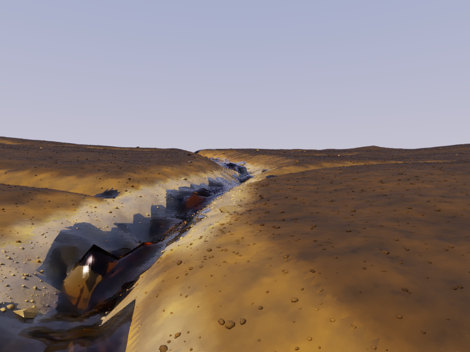
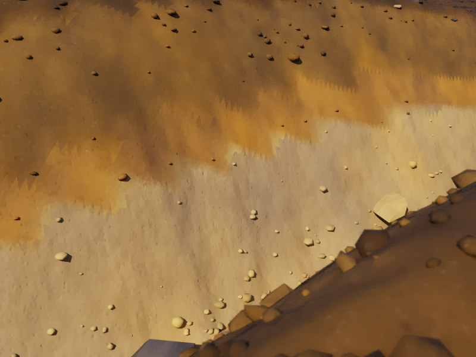

# CYBR TERRAIN

CYBR TERRAIN turns a seeded, layered terrain state into textured CYBR GEO geometry and renders it with native CYBR LIGHT. Surface runoff moves gravel, sand, and fines; erosion exposes surviving sediment interfaces; deposition preserves the transported grain mixture; infiltration fills a shallow soil bucket. Commands check water and grain inventories automatically and write a success receipt only after export and rendering finish.

The initial drainage and sediment history are authored, then the storm is simulated. Exchange rates use a recorded acceleration factor. This is a **procedural, uncalibrated process model**, with illustrative materials and render-only rock fragments and soil aggregates. It is unsuitable for geological, flood, or geotechnical prediction.

These development renders use actual meshes, procedural PBR textures, an authored daylight sky, and spectral transport. No generated imagery or scanned assets are used. They demonstrate the pipeline; visible broad-scale faceting and smooth surface detail still limit photographic realism. Plant and root networks, grain-resolved fracture, and turbulent sediment scattering remain outside the model.





| Render | Resolution | Spectral packets per pixel | Wavelengths per packet |
| --- | --- | ---: | ---: |
| Badlands | 800 × 600 | 96 | 8 |
| Watershed | 800 × 600 | 48 | 8 |
| Soil profile close view | 800 × 600 | 64 | 8 |

## Run the examples

Use Linux, Python 3.11–3.13, and a C++17 compiler. From the CYBR GEO checkout:

```bash
sudo apt-get install g++ libcairo2 libegl1 libgl1 libopengl0 libglib2.0-0
cd examples/terrain
python3 -m venv .venv
source .venv/bin/activate
python -m pip install -r requirements.txt
python -m pip install --no-deps --no-build-isolation -e .
terrain demo all --quality smoke --grid 33 --duration 2 --threads 2
terrain demo badlands --width 800 --spp 96
terrain demo watershed --width 800 --spp 48 --subdivision 3 --stones 400
terrain demo soil-profile --view macro --width 800 --spp 64 --subdivision 3 --stones 450
```

Open `outputs/<preset>/hero.png` or `macro.png` for the render and `terrain.glb` for the textured model. Each run preserves its state, numerical report, authoritative recipe assets, native linear film, display guides, and hashed receipt. Geometry is exported as metric glTF; CYBR LIGHT receives attribute-preserving indexed meshlets. Changing a view or render budget can reuse the checked simulation.

See the [example README](../examples/terrain/README.md), [process model](../examples/terrain/docs/MODEL.md), and [geometry/material notes](../examples/terrain/docs/GEOMETRY.md).

## Continuous soil contacts

The final soil close-up uses one blended albedo, normal and roughness material across geological contacts. The surface triangle geometry and saved state are preserved. Partial sediment coatings retain substrate microtexture, including at the outer blend edge.

| Earlier triangle-owned textures | Shared contact material |
| --- | --- |
|  |  |

[Unfiltered watershed](../media/light/terrain-watershed_unfiltered.png) · [Unfiltered soil close-up](../media/light/terrain-soil-profile_unfiltered.png) · [Earlier soil unfiltered](../media/light/terrain-soil-profile-before_unfiltered.png).

Badlands and watershed previews precede the contact correction. The retained badlands preview contains the finished PNG; its original linear film is not part of this gallery. The other native scene archives retain each view's own immutable recipe and film.
