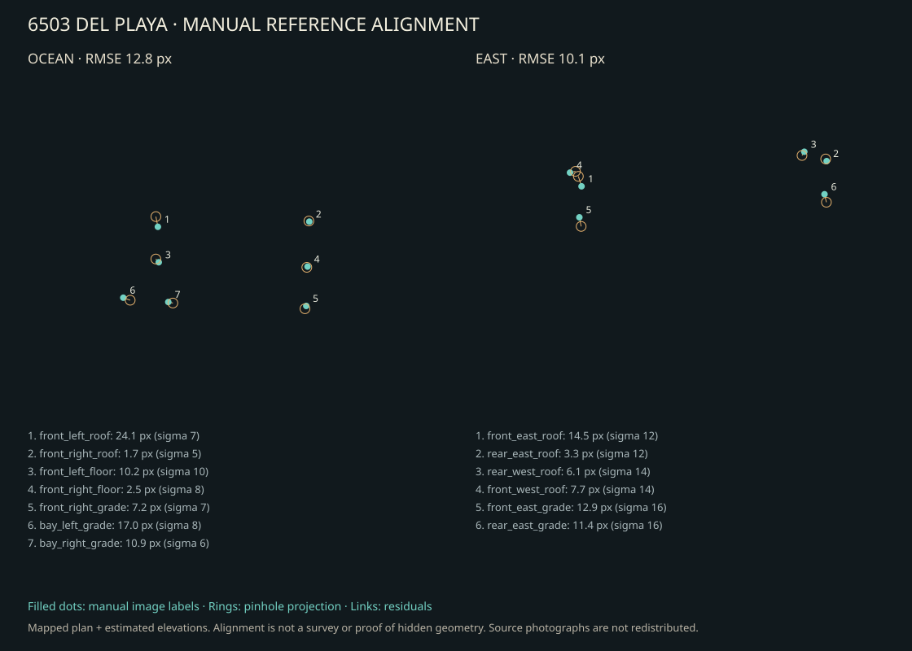
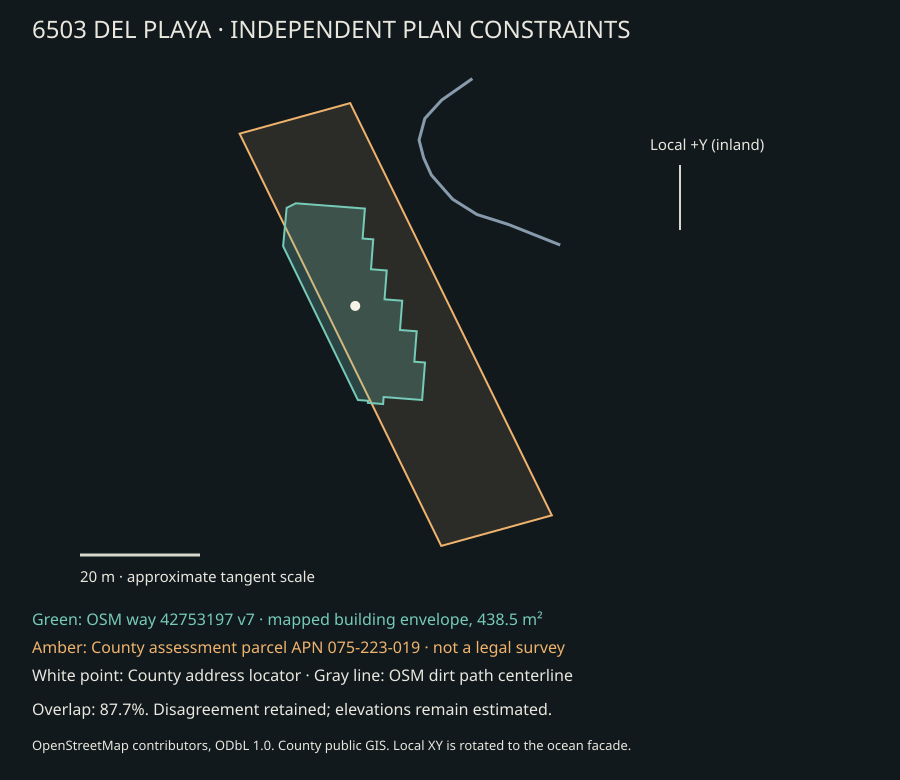

# 6503 Del Playa: map-constrained exterior reconstruction

The earlier shallow proxy is replaced by the stepped, approximately 32.8 m deep mapped plan, manually observed facade proportions, actual wall openings, single-sheet glazing, a projecting divided-window timber bay, individual beveled deck boards/joists/guards/fasteners, a brick patio lip, fine chain-link, curved leaves/trunks and a denser authored coastal site. CYBR LIGHT imports these actual named Part vertices, in metres, without replacing the architecture with its own proxy.

## Independent constraints and alignment

- [OpenStreetMap way 42753197](https://www.openstreetmap.org/way/42753197), version 7, dated 2022-05-16, supplies the lower-floor plan envelope. The ocean facade span is about 10.70 m; the rotated plan depth is 32.78 m. Neither is a surveyed architectural dimension. See `site_constraints.json` for source coordinates, approximate tangent conversion and attribution to OpenStreetMap contributors (ODbL 1.0).
- [Santa Barbara County assessment parcel layer](https://services.arcgis.com/KkJhFbLnXVqahKz2/ArcGIS/rest/services/Assessor_Parcels_Public1/FeatureServer/0) identifies APN 075-223-019, 6503 DEL PLAYA DR, and reported 0.35 acres. Its tax-assessment polygon is not a legal survey or a current bluff boundary. The [official address locator](https://services.arcgis.com/KkJhFbLnXVqahKz2/arcgis/rest/services/Address_Points/FeatureServer/0) independently ties the address to the same APN.
- Two [Zillow public exterior views](https://www.zillow.com/homedetails/6503-Del-Playa-Dr-2-Goleta-CA-93117/2079669030_zpid/) constrain facade proportions, deck density, lower bay, planting types and sparse camera alignment. `reference_manifest.json` records exact image URLs, dimensions and SHA-256 hashes. Photo capture dates are unknown. They are two views from one listing, not two independent surveys. Source photos are used for observation only and are not redistributed or included in a render asset.
- The visible sea/sky horizon in the east view provides an orientation constraint, separate from estimated building heights. `calibrate.py` fits a sparse pinhole camera to manually labeled authored landmarks; it performs no feature detection, SfM, triangulation, dense correspondence or reconstructed photographic geometry. `alignment.json` retains observations, uncertainty, projections, residuals and active bounds. RMS landmark error is 12.82 px in the 960×720 ocean view and 10.11 px in the 576×432 east view. Residuals are fitting errors, **not** dimensional accuracy or held-out validation. The ocean height and east lens fits reach bounds; pose and focal length remain ambiguous.



The parcel/footprint comparison retains a discrepancy: only **87.7%** of the mapped footprint lies inside the assessment polygon. We preserve both sources rather than distorting the plan to imply false agreement. `check_site.py`, `site_check.json` and the diagram make that comparison reproducible.



## Uncertainty that still matters

There is no parcel survey, architectural drawing set, calibrated camera metadata or DEM. Floor heights (2.62/2.72 m), upper facade corner/inset, roof thickness, openings, deck sections, patio extent, fence, bluff drop (about 7.2 m), beach slope and tide/wave state remain reference estimates. The OSM envelope may combine walls, recesses and balcony outlines; not every jog is confirmed in elevation. Hidden glazing recesses are shallow neutral presentation proxies tagged `unobserved-presentation-proxy`, not claimed accurate interiors. West-neighbor massing, park plaza/furniture/planting and distant landforms are context estimates. Only the named OSM park path centerline is map-constrained; its section/elevation is estimated. Photographed appearance is the target, not a claim about current structural condition.

The scene and metadata explicitly preserve: **no image generation, no photogrammetry, no scan geometry, no scan textures, no photographic textures, no photographic billboards**. Procedural mesostructure and vegetation are authored geometry. Detail count is not evidence of measured accuracy.

## Reproduce

With NumPy, SciPy and pytest installed:

```bash
PYTHONPATH=src python examples/del_playa_6503/recipe.py
python examples/del_playa_6503/calibrate.py
python examples/del_playa_6503/check_site.py
PYTHONPATH=src python -m pytest -q tests/test_del_playa_6503.py
```

The paired [CYBR LIGHT PR #6](https://github.com/cybrdelic/cybr-light/pull/6) contains the renderer bridge, presentation images, raw-film/noise receipts and source/binary hashes. It uses native continuous metric surface profiles and authored daylight, without importing these reference photographs into the scene.
