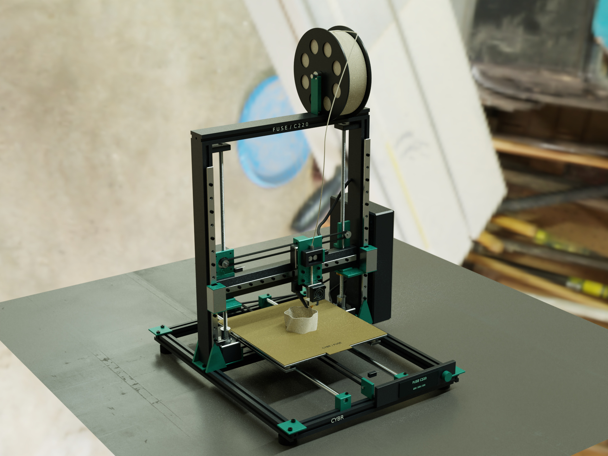

# CYBR FUSE / C220

An original Cartesian FFF printer designed with CYBR GEO, rendered with its native
V9 path tracer, and exercised with a deterministic extrusion toolpath.



This is a **digital prototype**. The evidence covers nominal geometry, selected
CAD interfaces, guide support, ideal motor/axis kinematics and G-code deposition.
A physical printer has not been built or tested. The STEP assembly is useful for
development and part/interface inspection; it is not a released manufacturing pack.

## Mechanism

| Subsystem | Model contract |
|---|---|
| Printable region | 220 × 220 × 220 mm |
| X | Moving direct-drive head; 12 mm rail; 2 mm pitch / 20T belt drive |
| Y | Moving 235 mm bed; two Ø10 mm guides; four linear bushings |
| Z | Two guided columns; two T8×8 screws and matched flange nuts |
| XY rotation distance | 40 mm per motor revolution |
| Z rotation distance | 8 mm per motor revolution |
| Hotend | Ø0.40 mm nozzle outlet, bored heatbreak, finned heatsink, heater cartridge |
| Material feed | 1.75 mm filament; direct drive with opposed 10.25 mm nominal hobs |
| Bed stack | Carrier → four standoffs → aluminium heater → magnet → PEI sheet |
| Control packaging | Side enclosure, display, encoder, endstop and probe envelopes |

The two timing belts have closed geometric paths. Individual modeled teeth wrap
around both pulleys and translate along the load/return spans. The Y bed moves
opposite the requested bed-coordinate Y; the nozzle stays on the machine's Y=0
plane. Pulley rotations and screw rotations derive from the same commanded axes.
Flexible filament and cable routes are regenerated at their actual moving endpoints.

The frame uses custom nominal slotted profiles. Rails, motors, bearing blocks,
screws and electronics use nominal envelopes; they are not imported vendor CAD.
A matched purchased lead screw/nut pair supplies the female thread/contact function:
the rendered male thread is a four-start mesh, while the analytic nut is a bored
clearance envelope. Belt tooth pockets and motor internals are simplified component
envelopes. These distinctions are recorded in the part roles and STEP coverage.

## Actual execution evidence

`verify_mechanism.py` builds fresh OpenCascade geometry and checks:

- Unique finite named meshes; every analytic body valid with positive volume.
- Closure and length of both belts; X/Y/Z guide support at full travel limits.
- 20,000 motor/axis conversion samples; 27 nozzle-datum poses.
- Boolean interference and minimum-distance queries for selected critical CAD pairs.
- 90 exact CAD intersection queries for translating bodies against fixed geometry
  across five full-travel poses, with zero detected collisions.
- Physical contact at selected bed-stack and carriage-mounting interfaces.
- The moving filament endpoint at the extruder inlet.

`toolpath.py` generates and parses a real G-code file for a six-lobed vessel. It
checks XYZ travel, material-volume consistency, a conservative flow bound, layer
support and 5,000 independent nozzle/bed-coordinate samples. Cold extrusion and
non-positive feeds are rejected. Out-of-travel and non-finite poses are rejected.
The logs contain actual pass/fail results; test definitions alone are not evidence.

The vessel has 180 layers at 0.20 mm, three 0.44 mm perimeter lines and four solid
bottom layers. Positive-E G-code moves create individual flattened beads. The
partial current bead ends at the moving nozzle. No prebuilt vase is revealed or
scaled. Bead cross-section and solidification are imposed geometry, not molten
polymer CFD or measured adhesion.

Timing accelerates each straight segment from rest at 600 mm/s². This conservative
model does not include firmware junction lookahead, input shaping, thermal waiting
time, pressure advance or measured stepper dynamics. It is not a print-time quote.

## Reproduce

From the repository root, install the CYBR GEO dependencies and use Python 3.12
with a C++17/OpenMP compiler and FFmpeg. All geometry coordinates are millimetres.
The example needs no external model download or image-generation service.

```bash
mkdir -p deliverables work
export OPENBLAS_NUM_THREADS=1
export OMP_NUM_THREADS=8
python examples/fuse_c220/toolpath.py deliverables/FUSE_C220_calibration.gcode
python examples/fuse_c220/verify_mechanism.py
python examples/fuse_c220/verify_edges.py
python examples/fuse_c220/render_delivery.py preview
python examples/fuse_c220/render_delivery.py stills
python examples/fuse_c220/render_delivery.py film
```

To exercise another machine pose from Python, put this example directory on
`sys.path`, then call `posed(build(), State(x=50, y=-50, z=100))` from `printer`.
All axis values are millimetres. `State` rejects coordinates outside the
specified travel region. The resulting assembly can use the same CYBR GEO
render and export functions as the supplied poses.

Optional: set `CYBR_GEO_EMBREE_ROOT` to an installed Embree 4 prefix. Without it,
CYBR GEO uses its native BVH accelerator. This changes acceleration, not geometry,
materials or light transport. The still/film code calls the shared V9 renderer
without modifying or forking its transport code.

Stills use 1920 × 1440 (hero/drive) and 1920 × 1280 (printing), 256 spp, 12-bounce
limit, thin-lens sampling, explicit part-attached PBR finishes and the V9 contract's
three guide-aware linear-light filtering passes. Unfiltered tone-mapped outputs
are retained for comparison. The operation film uses 960 × 720, 48 spp, 10 bounces
and 24 fps, matching V9's reference film budget. Each video frame is freshly traced.
A fixed random seed suppresses independent-frame sampling changes. The film has
no frame interpolation, image-generated objects or image-based camera pans.

The film labels the two-second variable-speed 180-layer time-lapse separately from the two-second
segment at modeled real time. Motion is accelerated in the time-lapse; it is not
a claim that a real printer can finish the vessel in two seconds.

Completed film frames are checkpoints in `work/film_frames`. Re-running `film`
reuses them. Clear that folder when changing the model, toolpath or render
settings. `render_delivery.py frames 41` regenerates a missing frame;
`render_delivery.py encode` assembles the movie once all 96 frames are present.
Large native render inputs use isolated temporary directories.

## Before a physical build

Reconcile the nominal envelopes with selected motors, guide blocks, lead nuts,
pulleys, hotend, controller and power supply. Drill/tap and fastener-stack details,
cable bend radii, connector retention, belt tension adjustment, endstop actuation,
probe offsets, firmware pins and calibrated thermal controls still need a
manufacturing/electrical design pass. The film does not establish stiffness,
backlash, vibration, hotend flow performance, bed flatness or print quality.

The example intentionally does not provide a guessed plug-and-play heater/pin
configuration. Configure the actual controller, then perform its documented
homing, motor-direction, temperature-sensor and heater checks on the built machine.

Kinematic convention references:
[Klipper rotation distance](https://www.klipper3d.org/Rotation_Distance.html) and
[Klipper configuration reference](https://www.klipper3d.org/Config_Reference.html).
Project code retains CYBR GEO's GPL-2.0-only license.
