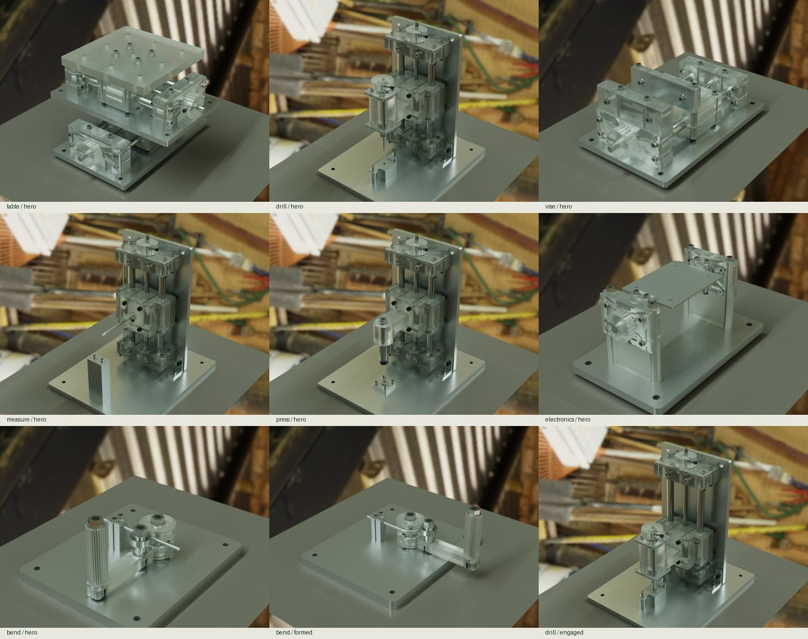
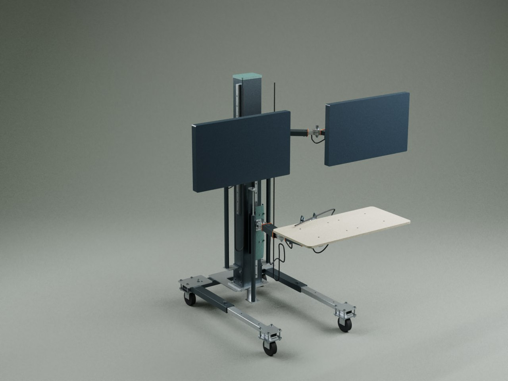
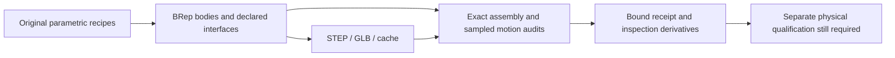

# ROAM: workshop mechanisms and articulated mobile workstation

Two related **nominal CAD studies**: seven bench mechanisms and the original shared-spine workstation with independent monitor and keyboard articulation. These are submissions for review, not a completed workshop or fabrication release.




The photographs are reduced versions of earlier geometry-rendered CYBR V9/Mitsuba outputs. The workshop uses a transparent-PETG dielectric/haze approximation; extrusion roads and infill are not resolved. The images are historical illustrations, not evidence that this port has passed validation.

## Reproduce

Use the repository's Python CAD environment (`pip install -e .` in an appropriate virtual environment). From the repository root:

```sh
python examples/roam/run.py bend
python examples/roam/run.py table
python examples/roam/run.py spine
```

Each run stages independent sources under `.build/roam/outputs/`, builds actual BRep/STEP/GLB geometry, then invokes its checker. `--out /path/to/build` relocates generated artifacts. `--stage-only` prepares sources without building. Each workshop run exports its printable bodies as STL after passing the gate. Do not treat a candidate export from a failed run as accepted. Keep several GB available for full exports and inspection derivatives.

The seven workshop identifiers are `table`, `drill`, `bend`, `vise`, `measure`, `press`, and `electronics`. The full program also needs cutting, sanding, sheet forming, heated inserts, machining, extraction and final assembly capabilities; see [the manufacturing map](MANUFACTURING.md).

| Example | Intended mechanism | Important limit |
| --- | --- | --- |
| table | Retained two-axis screw stage | No milling stiffness or cutting-force rating |
| drill | Guided feed with a manually rotated spindle | Not a powered metal-drilling machine |
| bend | Die, clamp and moving wire follower | Prescribed wire deformation, not material simulation |
| vise | Screw jaw, steel faces and supported sample | No rated clamping force |
| measure | Guided scriber with height adjustment | Nominal reference and scale are not calibrated |
| press | Guided steel tool contacting a supported sample | No pressing-force or bearing-installation rating |
| electronics | Supported PCB turnover fixture | Not a complete soldering station |
| spine | Mobile base, three articulated supports and cable-route study | Unselected hardware, blocked motion samples and unqualified loads |

## What the gates establish

Workshop checks include connected single-solid bodies, every static pair with exact intersections after broad phase, explicitly bounded nominal thread engagement, declared mating gaps, sampled independent travel and combined limits, service paths, retention probes, deliberate defects and source/output fingerprints. Inspection derivatives include actual solid sections and separated inventory. Thread envelopes generally do not model helical flanks. Sampled motion is not a continuous collision certificate.

Spine checks selected poses, sampled motion, specific service sequences and deliberate defects. **Its earlier review recorded 45 blocked samples out of 160**, even though the six selected static poses passed. A positive `geometry_review_passed` does not mean the entire coordinate envelope is usable. Read the blocked samples and the limitations in the regenerated receipt.

The spine port removes only local-web-app files from its review fingerprint list; it does not weaken physical collision or service checks. This is a headless CAD example: the separate local website and runtime-specific rendering wrappers are not shipped. Generated GLB and STEP files can be inspected with suitable viewers; sections and exploded derivatives are not production parts.

No force capacity, contact/friction behavior, fatigue, thermal behavior, tolerance stack or manufacturing readiness is established. Printed components are not a substitute for cutters, ground shafts, bearings, lead screws, heater elements or certified electrical hardware. Read [spine engineering](spine/ENGINEERING.md) and [assembly scope](spine/ASSEMBLY.md).

`historical-evidence.json` summarizes the earlier workspace receipts without private paths. It is not transplanted acceptance evidence for modified source. `PORT-VALIDATION.md` records tests actually run on this package.

## Construction and source attribution

Original procedural CAD uses the repository's `mechanism_lab` assembly/cache/export APIs and CadQuery. Purchased hardware is nominal and identified as such in recipe metadata. Component references remain in each workshop catalog's `sources` and in the spine engineering notes. No manufacturer internals are asserted. The examples use the repository's GPL-2.0-only license.


