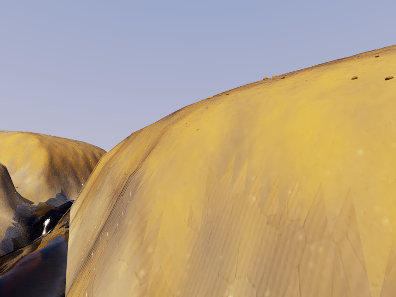

# CYBR TERRAIN

Layered earth that can erode, move, settle, and be inspected. CYBR TERRAIN turns a reproducible terrain state into textured **CYBR GEO** geometry and renders it with the native **CYBR LIGHT** spectral path tracer.

| Badlands | Watershed | Soil horizons |
| --- | --- | --- |
|  |  |  |

Actual native development renders. Remaining mesh faceting and surface detail limit photographic realism. [Gallery, sampling and unfiltered comparisons](docs/GALLERY.md).

The badlands, watershed, and soil-profile examples share one process model: surface runoff transports gravel, sand, and fines; erosion exposes the actual sediment stack; deposition retains the transported grain mixture; infiltration fills a shallow soil bucket. Water and each grain class are checked automatically before a successful result is written.

## Run it

Use Linux and Python 3.11–3.13. This example uses the parent CYBR GEO checkout and its matching native CYBR LIGHT source; a C++17 compiler builds the engine on first use.

```bash
sudo apt-get install g++ libcairo2 libegl1 libgl1 libopengl0 libglib2.0-0
cd examples/terrain
python3 -m venv .venv
source .venv/bin/activate
python -m pip install -r requirements.txt
python -m pip install --no-deps --no-build-isolation -e .
terrain demo badlands --quality preview
```

Open `outputs/badlands/hero.png` for the render and `outputs/badlands/terrain.glb` for the textured model. The same folder contains the saved simulation, numerical report, native linear film, and a final receipt with file hashes. Failed or incomplete runs do not receive a success receipt.

Each geometry/material recipe retains its own immutable `assets/<recipe hash>/` directory, including textures, lighting, the authoritative GLB, and a checked state snapshot. Rendering another view or changing detail settings preserves earlier scenes and receipt hashes. `terrain.glb` is a convenient alias for the latest recipe; the receipt identifies the authoritative model.

`demo` and `render` check image/detail budgets and compile the native engine before starting a long storm or export. Compilation is cached by source and compiler hashes. `terrain doctor` is an optional environment check; output validation happens automatically during the command.

```bash
# Quick end-to-end check, including all three presets.
terrain demo all --quality smoke --grid 33 --duration 2 --threads 2

# Natural material close view and an explicit soil cutaway.
terrain demo watershed --view macro --quality preview
terrain demo soil-profile --view profile --quality preview

# Reuse a saved state without rerunning the storm.
terrain render outputs/badlands/state.npz --width 1200 --spp 192
```

`terrain list` describes the scenarios. `terrain simulate` writes just the state and conservation report. Matching process settings and solver source reuse a state whose hash and successful report are verified. Changing a camera or material does not rerun the storm; `--force` regenerates it. Samples, image width, subdivision, and stone count are explicit render budgets.

State archives are closed and CRC-checked in a private staging directory before atomic publication. A corrupted simulation cache is regenerated automatically.

## What is physically modeled

Quantities use metres, seconds, and cubic metres. Layer porosity converts bulk thickness to solid volume. Signed face discharges update neighboring cells with equal and opposite transfers. The same limited fluxes advect sediment; settling separates the three grain classes; steep beds transfer actual material downslope. The exposed layer and wetness drive the geometry and material assignment.

The initial drainage and sediment history are authored, then the storm is simulated. Bed exchange uses a recorded acceleration factor. This is a reproducible procedural process model, **not a calibrated geological, flood, or geotechnical prediction**. Display-scale rock fragments and surface detail are recorded as rendering detail rather than added to the simulated inventory.

## Outputs and engineering

- Textured glTF 2.0 models contain metric geometry, material UVs, albedo, normals, and roughness channels.
- CYBR LIGHT evaluates roughness textures per hit, together with mapped normals and linear albedo. Display guides use the same material texture and vertex tint so filtering retains aggregate and mineral edges.
- Native rendering streams attribute-preserving meshlets into CYBR LIGHT's CPU BVH and spectral integrator.
- Linear PFM/EXR films remain available alongside the display PNG and first-hit guides.
- Seeded state files can be reloaded independently of rendering. Tests exercise lake-at-rest equilibrium, dry fronts, inventory depletion, grain transport, soil capacity, and water/solid conservation.

See [the process model](docs/MODEL.md), [geometry and materials](docs/GEOMETRY.md), and [validation](docs/VALIDATION.md). GPL-2.0-only; upstream source provenance is recorded in the parent CYBR GEO package.
