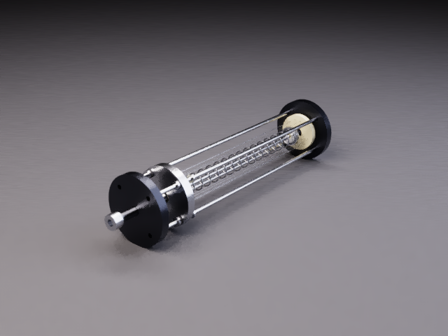

# Fresh CYBR LIGHT renders

These images were traced from the actual procedural assemblies on the CPU with
the bundled spectral engine. No image-generation step or reference backplate
was used. The display image uses three camera-footprint, geometry, component and
variance guided filtering passes, then ACES. Linear PFM/EXR films remain untouched
in the generated output folder.

| Assembly | Resolution | Packets × wavelengths |
| --- | --- | --- |
| [ORBIT](orbit_hero.png) | 1000 × 750 | 192 × 8 |
| [Nitinol actuator](nitinol_hero.png) | 640 × 480 | 128 × 8 |



[ORBIT unfiltered](orbit_hero_unfiltered.png) ·
[Nitinol unfiltered](nitinol_hero_unfiltered.png) ·
[Native metadata, commands and file hashes](renders.json).

```bash
lab render examples/orbit_inspection_wrist.py --view hero --size 1000x750 --spp 192 --threads 6 --out outputs/light-orbit/hero.png
lab render nitinol_fiber_actuator --size 640x480 --spp 128 --threads 4 --out outputs/light-nitinol/hero.png
```

These are finite-sample previews. The unfiltered images expose remaining Monte
Carlo noise. Rendering time depends strongly on geometry, depth and CPU resources.
The recorded kernel hashes identify the actual kernels used; the current engine
also includes exact ray-intersection reuse, tested against uncached output.
